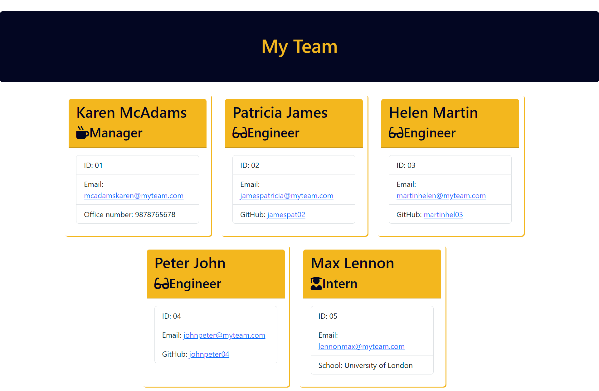

# CLI-Team-Profile-Generator

The Command line Team Profile Generator is an user application that has been created to generate a professional profile page for a team of any given size.This application uses the CLI (Command lIne Interface) to prompt the user to input the details of the employees and then creates a html page to display the profiles in a polished user interface.

The application has been built using node.js and ES6 primarily, and uses npm packages such as inquirer, jest, fs and util. Upon opening the application, the user is prompted to enter the name, id, email and office number of the manager. This has been made possible through the inquirer npm package which delivers the prompts and retrieves user data. This data is then used to create an object called manager, which is an instance of the Employee class that has been pre written and exported using module.exports. This object oriented programming method(OOP) makes the codes reusable and easy to maintain. 

Similar prompts and object creation is in use for collecting the engineer and intern's information. All the classes have been tested using jest test package. The tests were prewritten and the codes have been written to pass the tests.Once all the information is collected, team.html file is created using the page-template.js file. This file hold the format of the html file and the bootstrap links for styling. Custom styling has been added using the style.css file placed within the output folder.

## Built with

This repository has been built using

- Javascript
- ES6
- Object Oriented Programming
- Test Driven Development 
- Git
- Github
- Node.js
- Inquirer.js
- fs.js
- jest
- CLI
- font awesome

## Resources:
- https://www.npmjs.com/package/inquirer
- https://www.digitalocean.com/community/tutorials/nodejs-interactive-command-line-prompts
- https://developer.mozilla.org/en-US/docs/Web/JavaScript/Reference/Classes
- https://developer.mozilla.org/en-US/docs/Web/JavaScript/Reference/Operators/super
- https://www.w3schools.com/js/js_classes.asp

### Installation

To get started on creating a team profile, Node.js can be installed through visiting https://nodejs.org/en . This will also install the npm (Node Package Manager)
The package.json can be initialized through entering npm init command on the CLI.
To install the inquirer package:  'node i inquirer' command is executed through the command line.
The upon executing the 'node index.js' command, the prompts for the team profile generator should start
The code can be viewed at github: https://github.com/chrisma89/CLI-Team-Profile-Generator
The screenshot of the sample profile cretaed is as below: 

### Usage

This application is useful to create a single page profile information of a team. It is scable for larger companies with a variety of employee roles and designations.

### Credits

Thanks tot he curriculum team behind BCS for the starter files.
Thanks to the instructor, Laura Cole, for expalining the project and its requirements.

### Licence

The standard MIT Licence is in use for this repository.